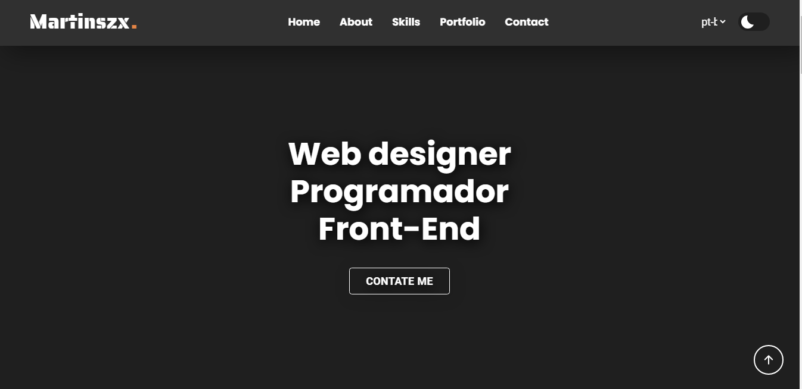

# Meu Portifólio
Feito com base em cursos que fiz,que mostra em prática meus conhecimentos em Desenvolvimento Web, mostrando minhas Habilidades, Ferramentas e projetos que fiz 

## Tabela de Conteúdos

- [Visão Geral](#visão-geral)
- [Capturas de Tela](#capturas-de-tela)

- [Linguagens](#linguagens-utilizadas)

## Visão Geral

Esse Projeto Mostra meus conhecimentos em HTML, CSS e JAVASCRIPT 

## Preview do Portifólio

 [Acesse o Site ](https://martinszx.github.io/Portifolio/)

## Linguagens Utilizadas

* HTML 
* CSS
* JAVASCRIPT
